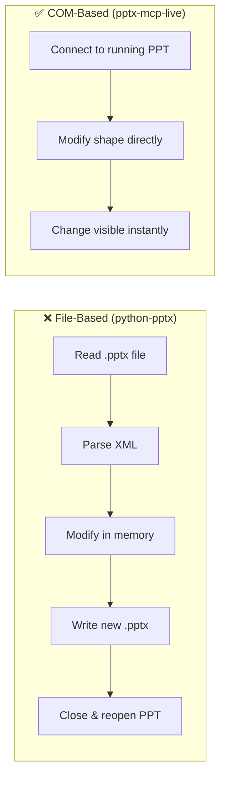
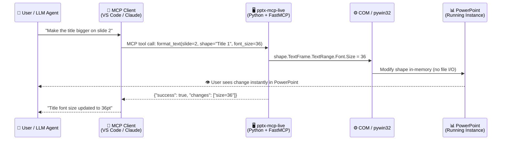
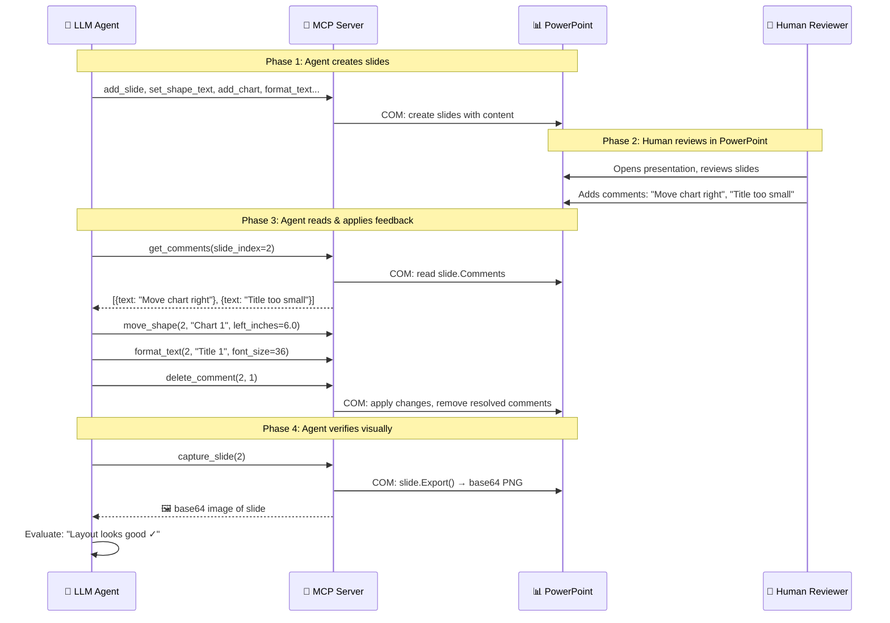

# pptx-mcp-live

**COM-based MCP server for Microsoft PowerPoint — 34 tools for live editing.**

[](https://github.com/jinqishen0725/pptx-mcp-live)
[](LICENSE)
[](https://python.org)
[](https://github.com/jinqishen0725/pptx-mcp-live)

---

## Why COM? Why Live Editing?

[COM (Component Object Model)](https://learn.microsoft.com/en-us/windows/win32/com/component-object-model--com--portal) is a Windows OS-level protocol that Microsoft Office was built around since the 1990s. Every single Office feature — from formatting a cell to inserting a chart — is exposed via COM. It's the same API that VBA macros use internally, which means **if you can do it in PowerPoint, you can automate it via COM**.

Most PowerPoint automation tools work on **files** — they read a `.pptx`, generate a new one, and overwrite. This means:

- ❌ You must **close PowerPoint** before editing
- ❌ Every change **regenerates the entire file**
- ❌ You can't make **small tweaks** without a full rebuild
- ❌ No way to **see changes in real-time**

**pptx-mcp-live uses COM automation** to edit presentations that are **already open in PowerPoint**. This means:

- ✅ **Edit while PowerPoint is open** — see changes instantly
- ✅ **Make targeted adjustments** — move one shape, change one font, without touching anything else
- ✅ **Interactive workflow** — tweak, preview, tweak again
- ✅ **Full PowerPoint fidelity** — animations, transitions, masters, themes all preserved





## Why Comments Matter (Human-in-the-Loop)

This server includes **comment tools** (add, get, delete) because comments enable a powerful **human-in-the-loop workflow**:

### Workflow 1: Agent Creates → Human Reviews → Agent Revises

1. **Agent creates slides** using the MCP tools (add slides, text, charts, images)
2. **Human opens PowerPoint** and reviews the slides visually
3. **Human adds comments** directly on shapes/slides: *"Make title bigger"*, *"Move chart to the right"*, *"Change color to match brand"*
4. **Agent reads comments** via `get_comments` and applies the requested changes
5. **Agent resolves/deletes comments** after addressing them

This is **much easier** than typing all feedback into a chat box. You can point at exactly what you want changed, right in the presentation.



### Workflow 2: Agent-Assisted Review

1. **Agent** reviews existing slides and adds comments with suggestions
2. **Human** reads agent's comments and accepts/rejects
3. **Agent** applies accepted changes

### Workflow 3: Visual Feedback Loop

The `capture_slide` tool returns a **base64 PNG screenshot** of any slide. The agent can:
1. Make an edit (e.g., move a shape)
2. Capture the slide to see the result
3. Evaluate if the layout looks right
4. Auto-correct if needed

## Features

- 🖥️ **Live COM Editing** — works with presentations open in PowerPoint
- 📊 **34 MCP Tools** — comprehensive automation toolkit
- 📝 **Comments** — add, read, delete for human-in-the-loop review
- 📸 **Visual Feedback** — `capture_slide` returns base64 PNG for agent self-correction
- 📐 **Precise Layout Control** — move, resize, align, distribute, rotate, z-order
- 📈 **Charts & Tables** — create embedded charts and tables with data
- 🖼️ **Images** — insert with position and size control
- 🎨 **Formatting** — text (bold, italic, font, size, color, alignment) and shapes (fill, border)
- 📄 **Export** — slides as PNG, full presentation as PDF
- 🔍 **Find & Replace** — across all slides or specific ones

## Quick Start

### Prerequisites

- **Windows 10/11** (required for COM automation)
- **Microsoft PowerPoint** (Office 365 or standalone)
- **Python 3.10+**

### Installation

```bash
pip install pywin32 "mcp[cli]>=1.2.0"

git clone https://github.com/jinqishen0725/pptx-mcp-live.git
cd pptx-mcp-live
pip install -e .
```

### Usage

Start the MCP server:

```bash
python -m pptx_mcp_live
```

### VS Code Copilot Configuration

Add to your `mcp.json` (Ctrl+Shift+P → "MCP: Open User Configuration"):

```json
{
  "servers": {
    "powerpoint": {
      "type": "stdio",
      "command": "python",
      "args": ["-m", "pptx_mcp_live"],
      "env": {}
    }
  }
}
```

### Claude Desktop Configuration

Add to `claude_desktop_config.json`:

```json
{
  "mcpServers": {
    "powerpoint": {
      "command": "python",
      "args": ["-m", "pptx_mcp_live"],
      "description": "Live PowerPoint editing via COM"
    }
  }
}
```

## Tool Reference

### 🔍 Inspection (3)

| Tool | Description |
|------|-------------|
| `list_open_presentations` | List all open presentations with slide counts |
| `inspect_presentation` | Get metadata: dimensions, layouts, slide summaries |
| `get_slide_info` | All shapes on a slide with type, text, position, size |

### 📖 Reading (4)

| Tool | Description |
|------|-------------|
| `read_slide_text` | Extract all text from all shapes on a slide |
| `read_slide_notes` | Read speaker notes |
| `read_shape_text` | Read text from a specific shape by name or index |
| `get_comments` | Get all comments with author, text, position |

### ✍️ Writing (7)

| Tool | Description |
|------|-------------|
| `add_slide` | Add a new slide with specified layout |
| `delete_slide` | Delete a slide by index |
| `duplicate_slide` | Duplicate a slide |
| `reorder_slide` | Move slide to a new position |
| `set_shape_text` | Write text to a shape |
| `set_slide_notes` | Set speaker notes |
| `add_text_box` | Add a text box with position, size, and text |

### 🎨 Formatting (3)

| Tool | Description |
|------|-------------|
| `format_text` | Bold, italic, underline, font, size, color, alignment |
| `format_shape` | Fill color, border color/width, transparency |
| `set_slide_background` | Set background color |

### 📐 Position & Layout (7)

| Tool | Description |
|------|-------------|
| `move_shape` | Move a shape to specific position (inches) |
| `resize_shape` | Resize a shape (inches) |
| `rotate_shape` | Rotate by degrees |
| `arrange_shape` | Z-order: bring to front, send to back |
| `align_shapes` | Align multiple shapes (left, center, right, top, middle, bottom) |
| `distribute_shapes` | Distribute shapes evenly (horizontal, vertical) |
| `group_shapes` | Group or ungroup shapes |

### 🖼️ Media (3)

| Tool | Description |
|------|-------------|
| `add_image` | Insert image (PNG, JPG, BMP) with position and size |
| `add_table` | Insert table with data |
| `add_chart` | Insert chart (column, bar, line, pie, area, scatter) |

### 📤 Export & Visual Feedback (3)

| Tool | Description |
|------|-------------|
| `export_slide_image` | Export a slide as PNG/JPG file |
| `capture_slide` | Screenshot as base64 PNG for agent visual feedback |
| `export_pdf` | Export presentation to PDF |

### 💬 Comments (2)

| Tool | Description |
|------|-------------|
| `add_comment` | Add a comment to a slide |
| `delete_comment` | Delete a comment by index |

### ⚙️ Advanced (2)

| Tool | Description |
|------|-------------|
| `find_replace` | Find and replace text across slides (with preview mode) |
| `save_presentation` | Save the active presentation |

## Architecture

```
pptx-mcp-live/
├── src/pptx_mcp_live/
│   ├── __init__.py          # Package init
│   ├── __main__.py          # Entry point: python -m pptx_mcp_live
│   ├── server.py            # FastMCP server with 34 tool registrations
│   ├── core/
│   │   ├── connection.py    # PowerPoint COM connection manager
│   │   └── errors.py       # ToolError exception
│   └── tools/
│       ├── inspection.py    # list, inspect, get_slide_info
│       ├── readers.py       # read text, notes, shapes, comments
│       ├── writers.py       # add/delete slides, set text, textbox
│       ├── formatters.py    # text format, shape format, background
│       ├── layout.py        # move, resize, align, distribute, group, rotate
│       ├── media.py         # image, table, chart
│       ├── export.py        # export image, PDF, capture (base64)
│       ├── comments.py      # add, delete comments
│       └── advanced.py      # find/replace, save
├── pyproject.toml
├── LICENSE
└── README.md
```

## Examples

### Create a Title Slide

```
User: "Create a presentation with a dark blue title slide saying 'Q3 Review'"

Agent:
1. add_slide(layout_index=1)                    → Title Slide layout
2. set_shape_text(3, "Title 1", "Q3 Review")    → Set title text
3. format_text(3, "Title 1", bold=True, font_size=44, font_color="#FFFFFF")
4. set_slide_background(3, "#1B2A4A")           → Dark blue background
5. capture_slide(3)                              → Verify the result
```

### Human-in-the-Loop Review

```
User: "Read the comments on slide 2 and apply the suggested changes"

Agent:
1. get_comments(2)                               → "Move chart right, make title bigger"
2. move_shape(2, "Chart 1", left_inches=6.0)     → Move chart
3. format_text(2, "Title 1", font_size=36)       → Bigger title
4. delete_comment(2, 1)                           → Mark as done
5. capture_slide(2)                               → Show result
```

### Batch Formatting

```
User: "Find all instances of 'FY25' and replace with 'FY26' across all slides"

Agent:
1. find_replace("FY25", "FY26", preview_only=True)  → "Found 8 matches across 4 slides"
2. find_replace("FY25", "FY26")                      → "Replaced 8 matches"
```

## Limitations

- **Windows only** — COM automation requires Windows OS
- **PowerPoint must be running** — cannot open files directly; works with already-open presentations
- **Single instance** — connects to the first running PowerPoint instance
- **Chart data** — `add_chart` with custom data may require closing the chart data editor first

## Contributing

Contributions welcome! Please:

1. Fork the repository
2. Create a feature branch
3. Test your changes with PowerPoint running on Windows
4. Submit a pull request

## License

[MIT License](LICENSE) — see LICENSE file for details.

## Acknowledgments

- [pywin32](https://github.com/mhammond/pywin32) — Python COM automation
- [FastMCP](https://github.com/jlowin/fastmcp) — MCP server framework
- [Excellm](https://github.com/mroshdy91/Excellm) — Inspiration for architecture pattern
- [word-mcp-live](https://github.com/ykarapazar/word-mcp-live) — Sister project for Word COM automation
